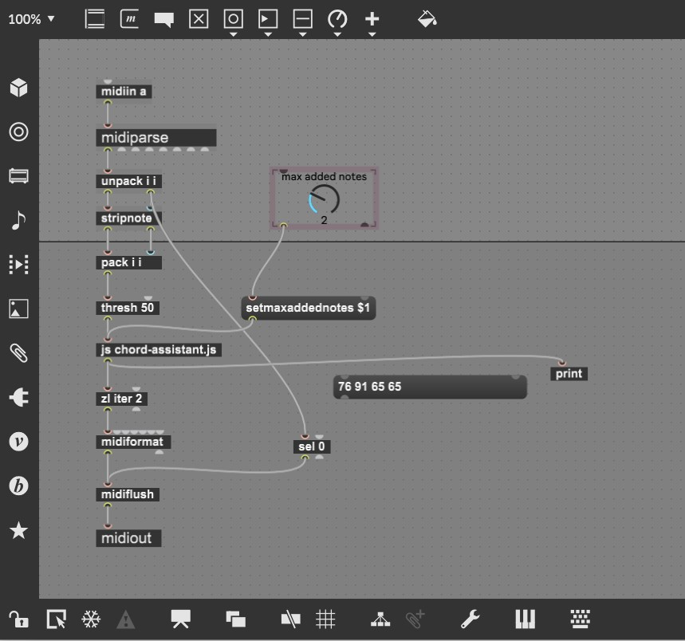

# chord-assistant

### Node.js, Typescript, Ramda, Webpack, Jest

Repo generates es3 compatible chord-assistant.js script to be used by a javascript module within [Max for Live](https://www.ableton.com/en/live/max-for-live/).

**Max** is a visual programming language that can be used to create music production software plugins. Max for Live is specifically tailored for use with **Ableton Live** (Digital Audio Workstation).

## Overview

The aim of this project was to randomly generate harmonic chords based on a set of input MIDI notes. The chord-assistant.js script achieves this by identifying possible scales a set of input notes can belong to, randomly assigning one of these scales to the notes, and adding N notes from the scale to the input notes. The output of this script is passed back to Max which converts the output data into MIDI. The amount of notes that can be added are defined by a 'max added notes' toggle within the Max project.

___

'**./build.sh**' will compile and bundle the project code into an es3 compatible script that can be used by Max.

